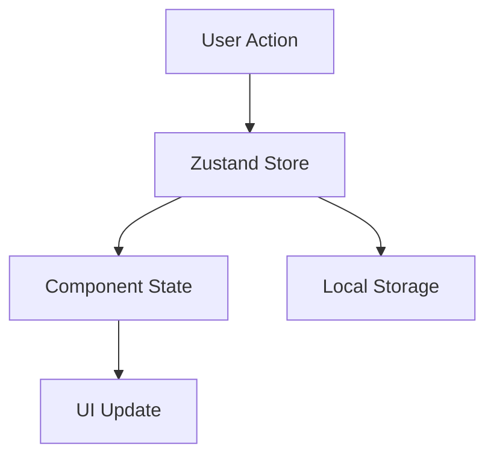
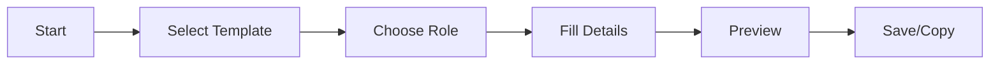

# ProLib - Knowledge Transfer Document

## Table of Contents
1. [Introduction](#introduction)
2. [Project Setup](#project-setup)
3. [Core Components](#core-components)
4. [Data Flow](#data-flow)
5. [Making Changes](#making-changes)
6. [Common Tasks](#common-tasks)
7. [Recent Updates and Features](#recent-updates-and-features)
8. [Development Guidelines](#development-guidelines)
9. [Testing Strategy](#testing-strategy)
10. [Maintenance Tasks](#maintenance-tasks)
11. [Troubleshooting Guide](#troubleshooting-guide)
12. [Future Development](#future-development)

## Introduction

ProLib is a Prompt Library Management System built with React and TypeScript. It helps users create, manage, and share AI prompts with features like templates, roles, and a multi-step creation process.

### Tech Stack
- Frontend: React + TypeScript
- State Management: Zustand
- Styling: Tailwind CSS
- Build Tool: Vite

## Project Setup

### Installation
1. Make sure you have Node.js version 18 or higher installed
2. Clone the repository
3. Run `npm install` to install dependencies
4. Run `npm run dev` to start development server

### Important Files and Folders
```
project/
├── src/
│   ├── components/     # React components
│   ├── store/         # State management
│   ├── types/         # TypeScript types
│   ├── data/          # Static data
│   └── App.tsx        # Main application
├── package.json       # Dependencies
└── vite.config.ts    # Build configuration
```

## Core Components

### 1. CreatePromptModal
**Location**: `src/components/CreatePromptModal.tsx`
**Purpose**: Handles the multi-step prompt creation process

How to modify:
- Add new step: Add a new case in the `renderStep` function
- Change validation: Modify the `validateStep` function
- Update UI: Each step is a separate component in the render method

### 2. ManageModal
**Location**: `src/components/ManageModal.tsx`
**Purpose**: Manages roles and templates

How to modify:
- Add new role fields: Update the Role interface in `types/index.ts`
- Change role behavior: Modify functions in `store/roleStore.ts`
- Update UI: The component uses a tab-based layout

### 3. PreviewPage
**Location**: `src/components/PreviewPage.tsx`
**Purpose**: Shows preview of created prompts

How to modify:
- Change layout: Update the JSX in the return statement
- Add features: Add new props to PreviewPageProps interface
- Modify styling: Update Tailwind classes in the component

### 4. Modal
**Location**: `src/components/Modal.tsx`
**Purpose**: Base modal component used throughout the app

How to modify:
- Change transitions: Update the transition classes
- Modify sizing: Update the sizeClasses object
- Change styling: Update the Tailwind classes

## Data Flow

### State Management


### Prompt Creation Flow


## Making Changes

### Adding a New Feature
1. Plan the feature and identify affected components
2. Update types in `src/types/index.ts` if needed
3. Add new state management in `src/store` if required
4. Create/modify components
5. Update tests if present

### Modifying UI
1. All styling uses Tailwind CSS
2. Common classes are:
   - Layout: flex, grid, p-4, m-2
   - Colors: bg-gray-100, text-blue-600
   - States: hover:bg-blue-700, focus:ring-2

### Example: Adding a New Button
```tsx
// In any component:
<button
  onClick={handleClick}
  className="px-4 py-2 text-white bg-blue-600 rounded-md hover:bg-blue-700"
>
  New Button
</button>
```

## Common Tasks

### 1. Adding a New Language
Location: `src/data/languages.ts`
```typescript
// Add a new entry:
{
  id: 'newlang',
  name: 'New Language',
  extension: '.ext',
  isCompiled: boolean
}
```

### 2. Modifying Role Templates
Location: `src/store/roleStore.ts`
1. Find the `defaultRoles` array
2. Add or modify role templates
3. Update type definitions if needed

### 3. Changing Modal Sizes
Location: `src/components/Modal.tsx`
1. Find the `sizeClasses` object
2. Modify existing or add new size classes
3. Update the size prop type definition

### 4. Adding Form Validation
Location: Any component with forms
1. Create validation function:
```typescript
const validateForm = (data: FormData) => {
  const errors: string[] = [];
  if (!data.required_field) {
    errors.push("Field is required");
  }
  return errors;
}
```
2. Use in component:
```typescript
const handleSubmit = () => {
  const errors = validateForm(formData);
  if (errors.length > 0) {
    // Show errors
    return;
  }
  // Process form
}
```

## Recent Updates and Features

### LLM Integration Enhancement
The application now includes improved LLM integration with Mistral AI, featuring intelligent code snippet handling:

1. Code Snippet Detection
   - Automatically detects different types of code snippets:
     - Regular code (functions, classes, components)
     - Test cases (unit tests, integration tests)
     - BDD scenarios (Gherkin syntax)

2. Smart File Handling
   - Intelligent file naming based on content analysis
   - Appropriate file extensions for different languages
   - Special handling for test and BDD files

3. Download and Copy Features
   - One-click copy functionality
   - Smart file downloads with proper naming
   - Language-specific file extensions

### Code Organization

#### PreviewPage Component
The PreviewPage component has been enhanced with several utility functions:

1. `detectSnippetType`
   - Analyzes code content
   - Identifies snippet types (code/test/BDD)
   - Uses pattern matching for detection

2. `getFileExtension`
   - Maps languages to correct extensions
   - Handles special cases (test files, BDD scenarios)
   - Provides fallback extensions

3. `detectCodeName`
   - Extracts meaningful names from code
   - Supports multiple naming patterns
   - Includes fallback naming strategy

## Development Guidelines

#### Adding New Features

1. Code Snippet Support
   ```typescript
   // To add support for a new language:
   const extensionMap = {
     existing_languages,
     new_language: 'extension'
   };
   ```

2. Snippet Type Detection
   ```typescript
   // To add new snippet type detection:
   if (content.matches(new_pattern)) {
     return 'new_type';
   }
   ```

#### Best Practices

1. File Naming
   - Use descriptive names based on content
   - Include language information
   - Handle special cases appropriately

2. Error Handling
   - Implement proper error boundaries
   - Provide fallback options
   - Log errors for debugging

3. Performance
   - Use efficient regex patterns
   - Implement proper memoization
   - Handle large files appropriately

## Testing Strategy

1. Unit Tests
   ```typescript
   describe('Snippet Detection', () => {
     test('should detect code snippets correctly', () => {
       // Test cases
     });
   });
   ```

2. Integration Tests
   ```typescript
   describe('File Download', () => {
     test('should download with correct name and extension', () => {
       // Test cases
     });
   });
   ```

## Maintenance Tasks

#### Regular Updates
1. Update language support
2. Enhance detection patterns
3. Improve error handling
4. Update documentation

#### Code Review Guidelines
1. Check for proper error handling
2. Verify file extension mapping
3. Test snippet detection
4. Review naming conventions

## Troubleshooting Guide

#### Common Issues

1. Incorrect File Extensions
   - Check language detection
   - Verify extension mapping
   - Ensure proper type detection

2. Snippet Detection Issues
   - Review detection patterns
   - Check content formatting
   - Verify language support

3. Download Problems
   - Check file name sanitization
   - Verify blob creation
   - Review error handling

## Future Development

#### Planned Improvements

1. Enhanced Detection
   - More language support
   - Better pattern matching
   - Improved naming algorithms

2. UI Enhancements
   - Better snippet visualization
   - Enhanced copy feedback
   - Improved error messages

3. Performance Optimization
   - Faster detection
   - Better file handling
   - Improved memory usage

## Tips for New Developers

1. **Start Small**: Begin by understanding the Modal component and how it's used throughout the app

2. **Use TypeScript**: Always define types for your props and state:
```typescript
interface MyComponentProps {
  title: string;
  onAction: () => void;
}
```

3. **State Management**: Use the Zustand store for global state:
```typescript
const myValue = useStore(state => state.myValue);
const updateValue = useStore(state => state.updateValue);
```

4. **Component Structure**:
- Keep components small and focused
- Use composition over inheritance
- Put shared logic in custom hooks

5. **Styling Guidelines**:
- Use Tailwind utility classes
- Follow existing color schemes
- Maintain responsive design

## Need Help?

1. Check the component's props and types
2. Look for similar implementations in existing code
3. Review the Zustand store implementation
4. Check component relationships in the data flow diagrams

Remember: The codebase follows a component-based architecture with TypeScript for type safety and Zustand for state management. When making changes, always consider type safety and maintain the existing code style.
